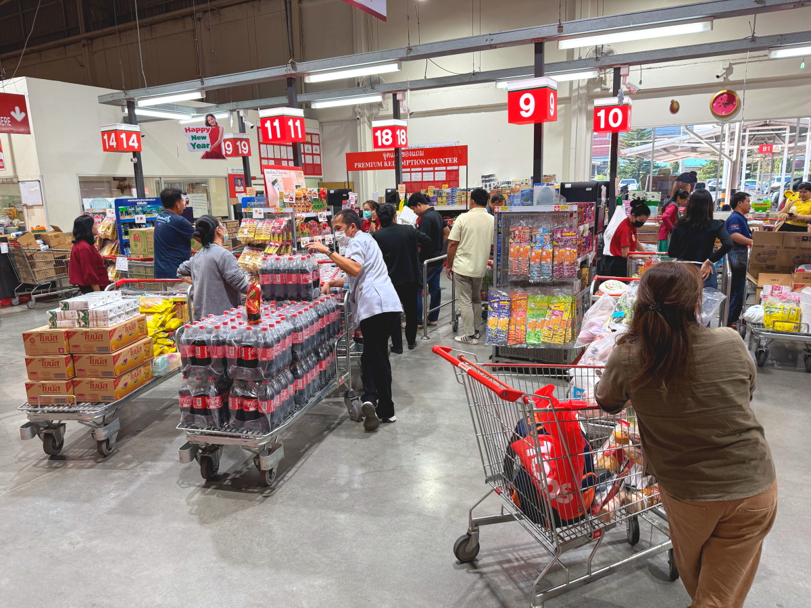

# 20241202_chiangrai

<html>
<head>

<meta charset="UTF-8">
<meta http-equiv="Content-Type" content="text/html; charset=UTF-8">
<meta http-equiv="X-UA-Compatible" content="IE=EmulateIE10" />
<meta http-equiv="X-UA-Compatible" content="IE=edge">

<!--ここから上はお決まりの定型文です-->

<!--ここからが表現の書式などを決めるcssという部分-->

<link href="https://cdnjs.cloudflare.com/ajax/libs/lightbox2/2.7.1/css/lightbox.css" rel="stylesheet">

</head>

<body>

モバイル端末をお使いの場合は、画面を横向きにすると
より見やすくご覧頂けます。

<!--ここ上は、ほぼそのまま使います！-->

<!--QRコードの挿入例-->

 アクセス用QRコード

<marquee direction="left" scrollamount="20" width="30%">(^_^)/~S,Hada</marquee>

<!--流れ文字の挿入例-->
<h1><marquee behavior="left">!!! 2024/11/29〜12/02 、チェンライ近郊の散策状況をまとめました !!!</marquee></h1>

                          

<!--ここから下が、本体部分-->

<h2>11月29日、披露宴の帰り道に、義兄の息子さんの食堂にお邪魔しました</h2>

<h2>夫婦で仲良く焼き鳥を焼きます</h2>

<h2>BGMはYouTubeの再生</h2>

  

<h2>11月30日はメーチャンの街中を散策</h2>

<h2>広場には可愛らしい？５つ目のオブジェ！</h2>

<h2>沿道のお花たちは、みんな綺麗！</h2>

<h2>夕暮れ時に囀る小鳥</h2>

<h2>夜には満点の星空</h2>

  

<h2>12月2日の朝は蒸しバナナ、お芋みたいな食感になります</h2>

<h2>お昼はちょっと洒落たレストラン</h2>

<h2>入り口にはプチ噴水のオブジェ、画像のクリックで動画再生します</h2>

<h2>店内の作りはこの辺りのお店としてはトップクラス</h2>

<h2>チャーハンとカレーを注文</h2>

<h2>水は日本と違って、有料で２０バーツ</h2>

<h2>店内からお店の外の国道を眺めた様子</h2>
<iframe width="560" height="315" src="https://www.youtube.com/embed/bYl9sukKCpc?si=8VQklab6co3_tOJU" title="YouTube video player" frameborder="0" allow="accelerometer; autoplay; clipboard-write; encrypted-media; gyroscope; picture-in-picture; web-share" referrerpolicy="strict-origin-when-cross-origin" allowfullscreen></iframe>
<h2>お会計は２２８バーツ ≒ 1000円</h2>

<h2>街中の雑貨屋さんでお買い物</h2>

<h2>店内の一角には仏壇が供えられています</h2>

<h2>外の道路で突然の渋滞</h2>

<h2>道路塞いで一般車が荷下ろししてて、後続車がハザード炊いて待ってました</h2>

<h2>街中のお医者さん、待合室は屋外！</h2>

<h2>この日も綺麗な夕焼けでした</h2>

  

<h2>12月2日はチェンライのお店を２軒梯子して本格的なお買い物</h2>
<h2>1件目は会員制のスーパー、日本のコストコに相当する店舗</h2>

<h2>商品の棚は倉庫レベル</h2>

<h2>僧侶も買い出し中でした</h2>

<h2>レジに並ぶ人たちの購入量が凄まじいレベル</h2>

<h2>このお店には仏壇に加えて、王室崇拝のお供えもありました</h2>

 
<h2>2軒目はこの辺りで最大のショッピングモール「CENTRAL」</h2>

<h2>タイのショッピングモールには店内に車のディーラーがあります</h2>

<h2>地下のフードコートでラーメンをいただきます 麺は一人前を掬い上げて、緑のハサミでカット</h2>

<h2>鶏肉ラーメンに好みのトッピングをかけていただきます</h2>

<h2>下前まで全てセルフのシステム</h2>

<h2>王室直営店がありました</h2>

<h2>こちらは産地直送店</h2>

<h2>店内の天井を飾る傘のオブジェ</h2>

<h2>店外通路にも傘のオブジェ</h2>

<h2>果物系のカップは定番商品でどこでも見ます</h2>

<h2>店外には木にお面をつけた巨大オブジェ</h2>

<h2>4人乗りスクーター、ハンドル操作は２番目の女の子 乗車順序は体格順か？</h2>

<h2>街道沿いには、かなりの時代もののお家</h2>

<h2>夜は満点の星空でした</h2>

<h2>チェンライ市内から北に向かって移動する様子</h2>
<iframe width="560" height="315" src="https://www.youtube.com/embed/LUC9Hn1xOxU?si=2xGqG9ewgXvd4LGd" title="YouTube video player" frameborder="0" allow="accelerometer; autoplay; clipboard-write; encrypted-media; gyroscope; picture-in-picture; web-share" referrerpolicy="strict-origin-when-cross-origin" allowfullscreen></iframe>

<!--
<h2>子供達の水泳教室も開催されていました → 
<a href="https://youtube.com/shorts/kVv7HzktC0A?feature=share" target="_blank">プール景観の動画</a>
</h2>
-->

   

   

         

  

      

<!--本体はここまで-->

<!--画面に空白地帯を作って、背景が見えるようにしています-->
                                              

<!-- フッタ -->
<footer>

Copyright 2024/12/03 S,Hada @ChiangRai

</footer>

<!--HPにさまざまなJavaScriptを呼び込むための書式-->

