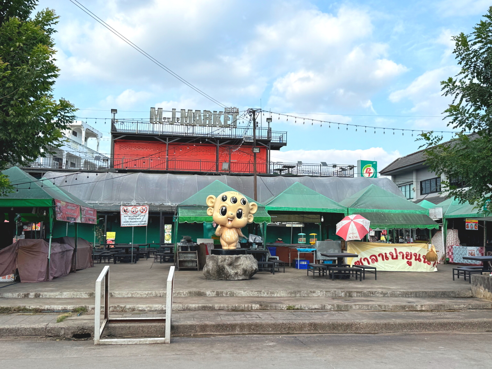

# 20241202_chiangrai

<html>
<head>

<meta charset="UTF-8">
<meta http-equiv="Content-Type" content="text/html; charset=UTF-8">
<meta http-equiv="X-UA-Compatible" content="IE=EmulateIE10" />
<meta http-equiv="X-UA-Compatible" content="IE=edge">

<!--ここから上はお決まりの定型文です-->

<!--ここからが表現の書式などを決めるcssという部分-->

<link href="https://cdnjs.cloudflare.com/ajax/libs/lightbox2/2.7.1/css/lightbox.css" rel="stylesheet">

</head>

<body>

モバイル端末をお使いの場合は、画面を横向きにすると
より見やすくご覧頂けます。

<!--ここ上は、ほぼそのまま使います！-->

<!--QRコードの挿入例-->

 アクセス用QRコード

<marquee direction="left" scrollamount="20" width="30%">(^_^)/~S,Hada</marquee>

<!--流れ文字の挿入例-->
<h1><marquee behavior="left">!!! 2024/11/29〜12/02 、チェンライ近郊の散策状況をまとめました !!!</marquee></h1>

                          

<!--ここから下が、本体部分-->

<h2>11月29日、披露宴の帰り道に、義兄の息子さんの食堂にお邪魔しました</h2>

  

<h2>11月30日はメーチャンの街中を散策</h2>

  

<h2>12月2日の朝は蒸しバナナ、お昼は洒落たレストランで食事でした</h2>

  

<h2>12月2日はチェンライのお店を２軒梯子して本格的なお買い物</h2>

<!--
<h2>子供達の水泳教室も開催されていました → 
<a href="https://youtube.com/shorts/kVv7HzktC0A?feature=share" target="_blank">プール景観の動画</a>
</h2>
-->

   

   

         

  

      

<!--本体はここまで-->

<!--画面に空白地帯を作って、背景が見えるようにしています-->
                                              

<!-- フッタ -->
<footer>

Copyright 2024/12/02 S,Hada @ChiangRai

</footer>

<!--HPにさまざまなJavaScriptを呼び込むための書式-->

